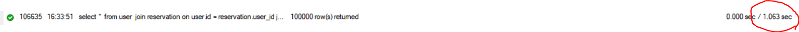
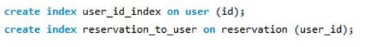
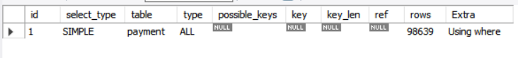
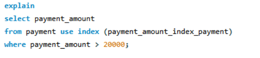
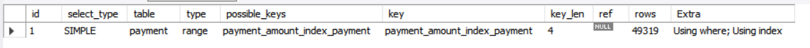
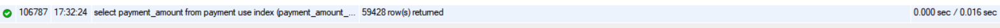

<h1 align="center" >QUE DOC  </h1>

<div align="center">
  
</div>

<br>
<br>

<h1 align="center" >🔥 팀 Ah Four 🔥 </h1>


<br>

## 👪 팀원

🏃 **서찬영**

 🏃 **김지원**

🏃 **박동휘**

🏃 **김기성**

🏃 **정지수**

<br>

# 📌 프로젝트 목표

<br>

**병원과 환자가 모두 편한 병원 예약 시스템**

<br>

# 🔧 기술 스택 
운영 환경  
 
 
 DB  
  

모니터링  
   

협업 툴  
  


<br>

# 📮 프로젝트 기획안

## 💊 소 개
  
  <b>최근 들어 소아과나 정신과같은 특정 과에 대한 수요가 늘어나고 있습니다. <br>
  수요가 늘어나는 만큼 병원 예약도 소위 말하는 “오픈런”을 하는 시대가 되었습니다. <br> 
  “큐닥”은 언제어디서나 편리하게 컴퓨터나 스마트폰으로 병원 예약을 가능하게 하는 헬스케어플랫폼입니다.<br>
  환자는 편리한 예약과 대기 시간을 확인할 수 있고, 병원의 평점도 공유해 병원을 선택하는 데 도움을 줄 수 있을 것입니다.<br>
  또한 병원은 환자 관리와 예약을 전산화하여 업무 부담을 줄이고 병원 운영의 효율성을 높일 수 있을 것으로 기대됩니다. 
</b>

## 📰  배 경 
<details> <summary> <b> 배경 설명 </b> </summary>
<div align="center">
  
</div>
  <br>

  >대형병원 쏠림 현상이 날이 갈수록 심각해지고 있다. 일단 예약 자체가 어렵고 지루한 대기 시간을 지나 의사와 대면해도 진료는 몇 분 만에 끝난다. 환자들 사이에서 ‘대기 1시간, 진료 3분’ 이라는 말이 나올 정도로 불편과 불만이 커지고 있는 이유다. 특히 코로나19 시기를 지나면서 호흡기내과 등의 검사에 환자가 몰리는 현상이 커졌지만, 공간과 인력이 부족해 당장 대책 마련도 쉽지 않은 실정이다.

  >7일 보건복지부의 ‘2022 의료서비스 경험조사’ 결과 보고서(전국 7000가구 15세 이상 1만6466명 대상)에 따르면 2021년 7월부터 2022년 6월까지 1년간 병·의원 외래 진료를 받았다고 답한 비율은 55.1%를 기록했다. 지난해 국민의 절반 이상이 병·의원을 찾아 외래 진료를 받은 것이다.

  >이들이 외래 진료를 받기 위해 대기한 시간은 평균 16.0분, 의사의 평균 진료 시간은 8.9분으로 조사됐다. 다만 진료 시간이 1∼5분이라는 응답 비율이 49.2%로 가장 높았다. 실제로 병원을 찾는 환자들 사이에서 ‘진료 3분’이라는 내용의 불만이 나오는 이유다. 아울러 평균 수치임을 감안해도 진료 시간에 비해 대기 시간이 2배가량 길다.
</details>

## 📓  시나리오 

<details> <summary> <b> 시나리오 펼쳐보기 </b> </summary>

## 사용자 <br>
#### 시나리오 : 예약 <br>

> 1.	사용자는 주변 병원을 진료과목, 병원종류, 지역으로 검색할 수 있다.
> 2.	조건에 맞는 병원이 거리순, 별점순으로 추천되며 사용자는 병원의 현재 대기열 상태, 예상 대기시간을 확인한다.
> 3.  사용자는 집에서 미리 진료 날짜, 시간, 진료 받을 의사를 선택한다.
> 4.  예약 세부사항을 작성 후 병원의 기본 진료비를 선결제하고 예약한다.
> 4.  사용자는 집에서 예상 진료시간에 병원으로 찾아간다.

## 병원 <br>
#### 시나리오 : 병원 등록
> 1.	병원 관리자가 웹사이트에 가입하여 “병원 등록” 메뉴를 클릭한다.
> 2.	병원의 기본 정보(병원 이름, 주소, 전화번호, 진료과목 등)를 입력한다.
> 3.	병원 운영시간과 예약 가능한 날짜를 설정한다.
> 4.  필요할 경우 의료진 정보, 공지사항을 추가로 입력한다.

#### 시나리오 : 예약자 관리 및 알림

> 1.	병원에서는 실시간으로 예약한 사용자를 확인하고 관리할 수 있다.
> 2.  예약한 시간이나 날짜에 진료가 어려울 경우 미리 연락하여 일정을 관리한다.
> 3.  예약한 시간의 1시간전에 병원에서 자동으로 메시지 알림을 보내 사용자에게 진료시간이 임박했음을 알린다.
> 4.  사용자는 예약에 요청사항을 적어 진료시 의료진에게 필요한 정보를 알릴 수 있다.


#### 시나리오 : 병원 운영 시간 및 정보 수정
> 1.	병원의 갑작스런 사정으로 영업여부와 시간을 수정하고 싶을 땐 간단하게 <br>
 “병원 정보 관리” 메뉴에서 운영 시간 및 진료 정보를 수정한다.
> 2.	병원에서 일하는 의료진의 진료가능 시간대도 업데이트 가능하다.
> 3.  변경사항은 공지사항으로 병원 상세 정보 페이지에서 알린다.
</details>


<br>

## 📃 요구사항 정의서
### 📑 <a href = "./project/요구사항 정의서.xlsx"> 요구사항 정의서  </a>
<br>

## 💿 ERD
### 📀 <a href = "./image/ERD.png"> ERD  테이블  </a>
<br>

## 💻 시스템 아키텍처

### 💾 <a href = "./image/architecture.png"> 시스템 아키텍처   </a>
<br>


 ## 🗄️ DDL

 #### 📁<a href = "./db/DDL.sql"> DDL.sql   </a>

<details> <summary> <b>펼쳐보기</b></summary> <br>

 <details><summary> <b>1. CREATE</b> </summary> <br>

<details><summary> <b>user</b> </summary>

```
create table user (
	id	varchar(100)	NOT NULL,
	password	varchar(100)	NOT NULL,
	nickname	varchar(100)	NOT NULL,
	email	varchar(100)	NOT NULL,
	phone_number	varchar(100)	NOT NULL,
	address	varchar(200)	NOT NULL
);
```

```
ALTER TABLE user ADD CONSTRAINT PK_USER PRIMARY KEY (
	id
);
```
</details>
<details><summary> <b>manager</b> </summary>

```
create table manager (
	id	varchar(100)	NOT NULL,
	password	varchar(100)	NOT NULL,
	nickname	varchar(100)	NOT NULL,
	email	varchar(100)	NOT NULL,
	phone_number	varchar(100)	NOT NULL,
	address	varchar(200)	NOT NULL
);
```

```
ALTER TABLE manager ADD CONSTRAINT PK_MANAGER PRIMARY KEY (
	id
);

```
</details>

<details><summary> <b>payment</b> </summary>

```
CREATE TABLE payment (
	reservation_idx	int auto_increment primary key NOT NULL,
	hospital_idx	int	NOT NULL,
	user_id	varchar(100)	NOT NULL,
	payment_amount	int	NOT NULL,
	payment_date	datetime	NOT NULL,
	payment_method	varchar(100)	NOT NULL,
	payment_status	varchar(100)	NOT NULL,
	update_at	timestamp	NOT NULL
);
```

```
ALTER TABLE payment ADD CONSTRAINT FK_reservation_TO_payment_1 FOREIGN KEY (
	reservation_idx
)
REFERENCES reservation (
	idx
)ON DELETE CASCADE;
```
```
ALTER TABLE payment ADD CONSTRAINT FK_reservation_TO_payment_2 FOREIGN KEY (
	hospital_idx
)
REFERENCES reservation (
	hospital_idx
) ON DELETE CASCADE;
```
```
ALTER TABLE payment ADD CONSTRAINT FK_reservation_TO_payment_3 FOREIGN KEY (
	user_id
)
REFERENCES reservation (
  user_id
)ON DELETE CASCADE;
```
</details>

<details><summary> <b>doctorInfo</b> </summary>

```
CREATE TABLE doctorInfo (
	hospital_idx	int	NOT NULL,
	name	varchar(100)	NOT NULL,
	detail	varchar(500)	NOT NULL
);
```
```
ALTER TABLE doctorInfo ADD CONSTRAINT FK_hospital_TO_doctorInfo_1 FOREIGN KEY (
	hospital_idx
)
REFERENCES hospital (
	idx
)ON DELETE CASCADE;
```
</details>


<details><summary> <b>department</b> </summary>

```
CREATE TABLE department (
	department	int	NOT NULL,
	hospital_idx	int	NOT NULL
);
```
```
ALTER TABLE department ADD CONSTRAINT FK_hospital_TO_department_1 FOREIGN KEY (
	hospital_idx
)
REFERENCES hospital (
	idx
)ON DELETE CASCADE;
```
</details>

<details><summary> <b>review</b> </summary>

```
create table review (
	user_id	varchar(100)	NOT NULL,
	hospital_idx	int	NOT NULL,
	title	varchar(200)	NOT NULL,
	contents	varchar(1000)	NOT NULL,
	created_at	timestamp	NOT NULL,
	rating	float	NOT NULL,
	password	varchar(100)	NOT NULL	DEFAULT 0000,
	released	boolean	NOT NULL
);
```
```
ALTER TABLE review ADD CONSTRAINT FK_user_TO_review_1 FOREIGN KEY (
	user_id
)
REFERENCES user (
	id
)ON DELETE CASCADE;
```
```
ALTER TABLE review ADD CONSTRAINT FK_hospital_TO_review_1 FOREIGN KEY (
	hospital_idx
)
REFERENCES hospital (
	idx
)ON DELETE CASCADE;
```
</details>

<details><summary> <b>hospital</b> </summary>

```
CREATE TABLE hospital (
	idx	int auto_increment primary key NOT NULL,
	manager_id	varchar(100)	NOT NULL,
	name	varchar (100)	NOT NULL,
	address	varchar(200)	NOT NULL,
	number	varchar(100)	NOT NULL,
	type	varchar(100)	NULL
);
```
```
ALTER TABLE hospital ADD CONSTRAINT FK_manager_TO_hospital_1 FOREIGN KEY (
	manager_id
)
REFERENCES manager (
	id
)ON DELETE CASCADE;
```
</details>

<details><summary> <b>reservation</b> </summary>

```
CREATE TABLE reservation (
	idx	int auto_increment	primary key NOT NULL,
	hospital_idx	int	NOT NULL,
	user_id	varchar(100)	NOT NULL,
	visit_user	varchar(100)	NOT NULL,
	phone_number	varchar(100)	NOT NULL,
	content	varchar(500)	NOT NULL,
	admit	boolean	NOT NULL,
	reservation_date	timestamp	NOT NULL
);
```
```
ALTER TABLE reservation ADD CONSTRAINT FK_hospital_TO_reservation_1 FOREIGN KEY (
	hospital_idx
)
REFERENCES hospital (
	idx
)ON DELETE CASCADE;
```
```
ALTER TABLE reservation ADD CONSTRAINT FK_user_TO_reservation_1 FOREIGN KEY (
	user_id
)
REFERENCES user (
	id
)ON DELETE CASCADE;
```
</details>

<details><summary> <b>monday</b> </summary>

```
CREATE TABLE monday (
	open	boolean	NOT NULL,
	open_time	time	NULL,
	close_time	time	NULL,
	hospital_idx	int	NOT NULL
);
```
```
ALTER TABLE monday ADD CONSTRAINT FK_hospital_TO_monday_1 FOREIGN KEY (
	hospital_idx
)
REFERENCES hospital (
	idx
)ON DELETE CASCADE;
```
</details>

<details><summary> <b>tuesday</b> </summary>

```
CREATE TABLE tuesday (
	open	boolean	NOT NULL,
	open_time	time	NULL,
	close_time	time	NULL,
	hospital_idx	int	NOT NULL
);
```
```
ALTER TABLE tuesday ADD CONSTRAINT FK_hospital_TO_tuesday_1 FOREIGN KEY (
	hospital_idx
)
REFERENCES hospital (
	idx
);
```
</details>

<details><summary> <b> wendsday</b> </summary>

```
CREATE TABLE wendsday (
	open	boolean	NOT NULL,
	open_time	time	NULL,
	close_time	time	NULL,
	hospital_idx	int	NOT NULL
);
```
```
ALTER TABLE wendsday ADD CONSTRAINT FK_hospital_TO_wendsday_1 FOREIGN KEY (
	hospital_idx
)
REFERENCES hospital (
	idx
);
```
</details>

<details><summary> <b>thursday</b> </summary>

```
CREATE TABLE thursday (
	open	boolean	NOT NULL,
	open_time	time	NULL,
	close_time	time	NULL,
	hospital_idx	int	NOT NULL
);
```
```
ALTER TABLE thursday ADD CONSTRAINT FK_hospital_TO_thursday_1 FOREIGN KEY (
	hospital_idx
)
REFERENCES hospital (
	idx
);
```
</details>

<details><summary> <b>friday</b> </summary>

```
CREATE TABLE friday (
	open	boolean	NOT NULL,
	open_time	time	NULL,
	close_time	time	NULL,
	hospital_idx	int	NOT NULL
);
```
```
ALTER TABLE friday ADD CONSTRAINT FK_hospital_TO_friday_1 FOREIGN KEY (
	hospital_idx
)
REFERENCES hospital (
	idx
);
```
</details>

<details><summary> <b>saturday</b> </summary>

```
CREATE TABLE saturday (
	open	boolean	NOT NULL,
	open_time	time	NULL,
	close_time	time	NULL,
	hospital_idx	int	NOT NULL
);
```
```
ALTER TABLE saturday ADD CONSTRAINT FK_hospital_TO_saturday_1 FOREIGN KEY (
	hospital_idx
)
REFERENCES hospital (
	idx
);
```
</details>

<details><summary> <b>sunday</b> </summary>

```
CREATE TABLE sunday (
	open	boolean	NOT NULL,
	open_time	time	NULL,
	close_time	time	NULL,
	hospital_idx	int	NOT NULL
);
```
```
ALTER TABLE sunday ADD CONSTRAINT FK_hospital_TO_sunday_1 FOREIGN KEY (
	hospital_idx
)
REFERENCES hospital (
	idx
);
```
</details>

<details><summary> <b>announcement</b> </summary>

```
CREATE TABLE announcement (
	hospital_idx	int	NOT NULL,
	title	varchar(200)	NOT NULL,
	contents	varchar(2000)	NOT NULL,
	created_at	timestamp	NOT NULL
);
```
```
ALTER TABLE announcement ADD CONSTRAINT FK_hospital_TO_announcement_1 FOREIGN KEY (
	hospital_idx
)
REFERENCES hospital (
	idx
);
```
</details>
<br><br>

</details>

<details><summary> <b>2. INSERT</b> </summary> <Br>

<details><summary> <b>1. 사용자 가입</b> </summary>

```
insert user value(name, id, password, nickname, email, number, address) values ('name','id','password','nickname','email','010-0000-0000','address');

```
</details>

<details><summary> <b>2. 관리자 가입</b> </summary>

```
insert into manager (name, id, password, email, number, business_number) values ('name','id','password','email','010-0000-0000','business_number');

```
</details>

<details><summary> <b>3. 관리자 등록</b> </summary>

```
insert hospital (manager_id	varchar(100),name,address,number,type) values (?,?,?,?,?,?);
```
</details>

<details><summary> <b>4. 공지사항 올리기</b> </summary>

```
insert into announcement(title, contents,hospital_id, created_by) values(?,?,>,?);

```
</details>

<details><summary> <b>5. 예약 결제</b> </summary>

```
insert into payment(hospital_idx,	user_id,	payment_amount,
	payment_date,	payment_method,	payment_status,
	update_at) values (?,?,?,?,?,?,?);

```
</details>

<details><summary> <b>6. 리뷰 작성</b> </summary>

```
insert into review(title, contents, user_id, password, rating, created_by, release,hospital_id) values(?,?,?,?,?,?,?);

```
</details>

<details><summary> <b>7. 병원예약</b> </summary>

```
insert into reservation(hospital_idx,
	user_id,
	visit_user,
	phone_number,
	content,
	admit,
	reservation_dat) values(?,?,?,?,?,?,?);

```
</details>
<Br>
</details>

<details><summary> <b>3. SELECT</b> </summary>

<br>
<details><summary> <b>1. 사용자 로그인 </b> </summary>

```
select id, password from user where id = 'id' and password = 'password';

```
</details>
<details><summary> <b>2. 사용자 정보 조회</b> </summary>

```
select * from user where id = user_id;

```
</details>


<details><summary> <b>3. 관리자 로그인</b> </summary>

```
select id, password from manager where id = 'id' and password = 'password';

```
</details>

<details><summary> <b>4. 관리자 정보 조회</b> </summary>

```
select * from manager where id = user_id;

```
</details>

<details><summary> <b>5. 병원 정보 조회</b> </summary>

```
select * from hospital where manager_id = 'manager_id';

```
</details>

<details><summary> <b>6. 이름으로 찾기</b> </summary>

```
select name from hospital where name = 'hospital_name';

```
</details>

<details><summary> <b>7. 진료과목으로 찾기</b> </summary>

```
select name from hospital join department on hospital.id = department.hospital_id where department.name ='department_name';

```
</details>

<details><summary> <b>8. 병원 종류로 찾기</b> </summary>

```
select name from hospital where hospital_type = 'type';

```
</details>

<details><summary> <b>9. 지역으로 찾기</b> </summary>

```
select name from hospital where address = '%강남구%';

```
</details>

<details><summary> <b>10. 리뷰 조회</b> </summary>

```
select * from review where hospital_id = 'id' order by created_by;
```
```
select * from review where user_id = 'id' order by created_by;

```
</details>

<details><summary> <b>11. 종합 조회</b> </summary>

```
select sum(rating)/count(rating),* from review where hospital_id = id group by hospital_id;

```
</details>

<details><summary> <b>12. 예약 조회</b> </summary>

```
select * from reservation where user_id = 'id';
```
```
select * from reservation where hospital_id = 'id';

```
</details>

<details><summary> <b>13. 예약 확정 알림 ~ 예약 시간 알림</b> </summary>

```
select number from reservation join user on reservation.user_id = user.id where user.id = id;
```
</details><br>
</details>

<details><summary> <b>4. DELETE</b> </summary><br>
<details><summary> <b>1. 회원 탈퇴</b> </summary> 

```
delete from user where id = id;

```
</details>


<details><summary> <b>2. 관리자 탈퇴</b> </summary>

```
delete from manager where id = id;

```
</details>


<details><summary> <b>3. 결제 환불</b> </summary>

```
delete from payment where id = 'id';

```
</details>


<details><summary> <b>4. 리뷰 삭제</b> </summary>

```
delete from review where user_id ='id' and password='password';

```
</details>


<details><summary> <b>5. 예약 취소</b> </summary>

```
delete from reservation where idx = idx;

```
</details><br>
</details>
<details><summary> <b>5. UPDATE</b> </summary><br>
<details><summary> <b>1. 관리자 정보 수정</b> </summary>

```
update manager set password = 'newpassword' where id ='id';

```
</details>

<details><summary> <b>2. 병원 정보 수정  </b> </summary>

```
update hospital set hospital_type = 'another type';
```
</details>


<details><summary> <b>3. 리뷰 수정</b> </summary>

```
select user_id, password from review where user_id = 'id' and password = 'password'; 
update review set contents = 'newcontents'  where idx = idx;

```
</details>


<details><summary> <b>4. 예약 수정</b> </summary>

```
update reservation set name = 'newname' where idx=idx;

```
</details>

</details>

</details>

<br>


## 💡 성능 개선  

<details> <summary><b>성능 개선 사례<b> </summary> <br>

<details><summary><b>INDEX 적용 사례_1<b> </summary> <br>

### INDEX 적용 이유

> user의 id를 이용한 SELECT문이 많음을 확인 <br>
> explain으로 탐색 rosw를 확인<br>
> 매번 전체 테이블을 탐색하는 것을 발견<br>
> user의 id를 index로 등록하여 탐색 rows를 줄이고자함

<br>
<div>
  
</div>
<div >
  
</div>

> 일반 쿼리문 실행시실행시간 1.063 sec

<br>

<div >
  
</div>
<div >
  
</div>
<br>

> 일반 쿼리문 실행시실행시간 0.813 sec

> 결과: 실행시간 약 0.2초 단축
</details>
<details><summary><b>INDEX 적용 사례_2<b> </summary> <br>

### INDEX 적용 이유

> 결제금액으로 조회하는 SELECT문이 많음을 확인 <br>
> explain으로 탐색 rosw를 확인<br>
> 전체 테이블을 탐색하는 것을 발견<br>
> payment의 payment_amount를 index로 등록하여 탐색 rows를 줄이고자함

<div>
  
</div>
<div >
  
</div>
<div>
  
</div>

<br>

>  일반쿼리문 실행시 row 98639
실행시간 0.110 sec


<div >
  
</div>
<div >
  
</div>
<div >
  
</div>
<div >
  
</div>
<br>


> 인덱스 쿼리문 실행시 row 49319 실행시간 0.016 sec

> 결과: 성능 rows: 50% 향상
실행시간 약 0.1초 단축

</details>
</details>
</details>