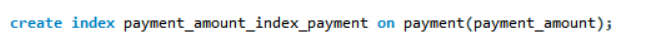

<h1 align="center">기반기술 프로젝트 👍</h1>

<div align="center">
  
</div>

>##  한화시스템 BEYOND  Ah Four - QUE DOC 

<br>

## 🤼‍♂️팀원

팀원 : 🐯 **서찬영**

팀원 : 🐶 **김지원**

팀원 : 🐺 **박동휘**

팀원 : 🐱 **김기성**

팀원 : 🦁 **정지수**

<br>

## 📌 프로젝트 목표

효율적인 병원 예약 시스템 만들기

<br>

## 🔧 기술 스택 
운영 환경  
 
 
 DB  
  

모니터링  
   

협업 툴  
  


<br>

## 📮 프로젝트 기획안

## 1.1 소 개
  
  최근 들어 소아과나 정신과같은 특정 과에 대한 수요가 늘어나고 있다. 
  수요가 늘어나는 만큼 병원 예약도 소위 말하는 “오픈런”을 하는 시대가 되었다. 
  “똑?닥”은 언제어디서나 편리하게 컴퓨터나 스마트폰으로 병원 예약을 가능하게 하는 헬스케어플랫폼이다.
  환자는 편리한 예약과 대기 시간을 확인할 수 있고, 병원의 평점도 공유해 병원을 선택하는 데 도움을 줄 수 있을 것이다.
  또한 병원은 환자 관리와 예약을 전산화하여 업무 부담을 줄이고 병원 운영의 효율성을 높일 수 있을 것으로 기대된다. 

## 1.2 배 경 

<div align="center">
  
</div>
  <br>

  대형병원 쏠림 현상이 날이 갈수록 심각해지고 있다. 일단 예약 자체가 어렵고 지루한 대기 시간을 지나 의사와 대면해도 진료는 몇 분 만에 끝난다. 환자들 사이에서 ‘대기 1시간, 진료 3분’ 이라는 말이 나올 정도로 불편과 불만이 커지고 있는 이유다. 특히 코로나19 시기를 지나면서 호흡기내과 등의 검사에 환자가 몰리는 현상이 커졌지만, 공간과 인력이 부족해 당장 대책 마련도 쉽지 않은 실정이다.

  7일 보건복지부의 ‘2022 의료서비스 경험조사’ 결과 보고서(전국 7000가구 15세 이상 1만6466명 대상)에 따르면 2021년 7월부터 2022년 6월까지 1년간 병·의원 외래 진료를 받았다고 답한 비율은 55.1%를 기록했다. 지난해 국민의 절반 이상이 병·의원을 찾아 외래 진료를 받은 것이다.

  이들이 외래 진료를 받기 위해 대기한 시간은 평균 16.0분, 의사의 평균 진료 시간은 8.9분으로 조사됐다. 다만 진료 시간이 1∼5분이라는 응답 비율이 49.2%로 가장 높았다. 실제로 병원을 찾는 환자들 사이에서 ‘진료 3분’이라는 내용의 불만이 나오는 이유다. 아울러 평균 수치임을 감안해도 진료 시간에 비해 대기 시간이 2배가량 길다.

## 1.3 시나리오 

시나리오 1: 예약
사용자: 본인/보호자의 건강 문제가 발생했거나, 병원을 바로 가야하는 상황
1.	사용자는 웹사이트에 접속해 예약 옵션을 선택 후 예약을 할 수 있다.
2.	주변 병원 검색이나 인기순으로 정렬된 병원 목록을 보고 예약할 수 있다.
3.	병원의 자세한 정보와 현재 대기인원, 대기시간을 볼 수 있다.
4.	방문을 원하는 특정 병원 이름을 검색해 예약할 수 있다.

시나리오 2: 진료 일정 조율
사용자: 특정 날짜와 시간에만 가능한 직장인
1.	사용자가 자신이 가능한 시간대를 입력하고,  목록에서 진료 과목과 병원을 선택 후 예약할 수 있다.

시나리오 3: 대기자 관리 및 알림
사용자: 원하는 병원이 예약이 꽉 찬 상태에서 예약을 원하는 환자
1.	사용자는 대기 알림 신청을 통해 예약 가능 알림을 받을 수 있다.

## 병원
시나리오 1: 병원 등록
사용자 : 새로운 병원이 플랫폼에 가입
1.	병원 관리자가 웹사이트에 접속하여 “병원 등록” 메뉴를 클릭.
2.	병원의 기본 정보(병원 이름, 주소, 전화번호, 진료과목 등)를 입력.
3.	병원 운영시간과 예약 가능한 슬롯 설정.
4.	필요한 경우 의료진 정보를 추가로 입력.

시나리오 2: 병원 운영 시간 및 정보 수정
사용자 :  병원의 운영 시간이 변경되거나 진료과목이 추가
1.	“병원 정보 관리” 메뉴에서 운영 시간 및 진료 정보를 수정
2.	예약 가능한 의료진의 진료 시간대를 업데이트

시나리오 3: 예약 환자 관리
사용자 :  예약한 환자 정보를 확인하고 관리
1.	병원 관리자가 대시보드의 “예약 관리” 메뉴에 접속.
2.	날짜별 예약 목록 확인.
3.	특정 환자의 예약 세부 정보를 클릭하여 진료 목적과 요청 사항 검토.
4.	예약 상태(확정, 취소, 대기)를 업데이트하거나 메모 추가.

시나리오 4: 예약 일시 중지 및 재개
사용자 : 갑작스런 휴무 및 운영 일시 중단 상황
1.	병원 관리자가 대시보드에서 “예약 설정” 메뉴 선택.
2.	예약 일시 중지 버튼 클릭 및 중지 사유 입력(예: 내부 사정으로 인한 휴무).
3.	예약 재개가 가능할 경우 다시 활성화 버튼 클릭.


<br>

## 📜 요구사항 정의서
[요구사항 정의서] 
<div align="center">
  
</div>
<br>

## 🎀 ERD
[ERD] 
<div align="center">
  
</div>
<br>

## 💻시스템 아키텍처
[시스템 아키텍처]
<div align="center">
  
</div>
<br>

## 🗄️ SQL 실행문문 

<details><summary> <b>1. 사용자 가입</b> </summary>

```
insert user value(name, id, password, nickname, email, number, address) values ('name','id','password','nickname','email','010-0000-0000','address');

```
</details>
<details><summary> <b>2. 사용자 로그인 </b> </summary>

```
select id, password from user where id = 'id' and password = 'password';

```
</details>
<details><summary> <b>3. 사용자 정보 조회</b> </summary>

```
select * from user where id = user_id;

```
</details>
<details><summary> <b>4. 사용자 정보 수정</b> </summary>

```
update user set password = 'newpassword' where id = 'id';

```
</details>
<details><summary> <b>5. 회원 탈퇴</b> </summary>

```
delete from user where id = id;

```
</details>
<details><summary> <b>6. 관리자 가입</b> </summary>

```
insert into manager (name, id, password, email, number, business_number) values ('name','id','password','email','010-0000-0000','business_number');

```
</details>

<details><summary> <b>7. 관리자 로그인</b> </summary>

```
select id, password from manager where id = 'id' and password = 'password';

```
</details>
<details><summary> <b>8. 관리자 등록</b> </summary>

```
insert hospital 
```
</details>
<details><summary> <b>9. 관리자 정보 조회</b> </summary>

```
select * from manager where id = user_id;

```
</details>

<details><summary> <b>10. 관리자 정보 수정</b> </summary>

```
update manager set password = 'newpassword' where id ='id';

```
</details>

<details><summary> <b>11. 관리자 탈퇴</b> </summary>

```
delete from manager where id = id;

```
</details>

<details><summary> <b>12. 병원 정보 수정  </b> </summary>

```
update hospital ;
```
</details>

<details><summary> <b>13. 병원 정보 조회</b> </summary>

```
select * from hospital where manager_id = 'manager_id';

```
</details>

<details><summary> <b>14. 이름으로 찾기</b> </summary>

```
select name from hospital where name = 'hospital_name';

```
</details>

<details><summary> <b>15. 진료과목으로 찾기</b> </summary>

```
select name from hospital join department on hospital.id = department.hospital_id where department.name ='department_name';

```
</details>

<details><summary> <b>16. 병원 종류로 찾기</b> </summary>

```
select name from hospital where hospital_type = 'type';

```
</details>

<details><summary> <b>17. 지역으로 찾기</b> </summary>

```
select name from hospital where address = '%강남구%';

```
</details>

<details><summary> <b>18. 공지사항 올리기</b> </summary>

```
insert into announcement(title, contents,hospital_id, created_by) values(?,?,?);
select * from announcement where hospital_id = 'id';

```
</details>

<details><summary> <b>19. 예약 결제</b> </summary>

```
insert into payment() values ();

```
</details>

<details><summary> <b>20. 결제 환불</b> </summary>

```
delete from payment where id = 'id';

```
</details>

<details><summary> <b>21. 리뷰 작성</b> </summary>

```
insert into review(title, contents, user_id, password, rating, created_by, release,hospital_id) values(?,?,?,?,?,?,?);

```
</details>

<details><summary> <b>22. 리뷰 조회</b> </summary>

```
select * from review where hospital_id = 'id' order by created_by;
select * from review where user_id = 'id' order by created_by;

```
</details>

<details><summary> <b>23. 리뷰 삭제</b> </summary>

```
delete from review where user_id ='id' and password='password';

```
</details>

<details><summary> <b>24. 리뷰 수정</b> </summary>

```
select user_id, password from review where user_id = 'id' and password = 'password'; 
update review set contents = 'newcontents'  where idx = idx;

```
</details>

<details><summary> <b>25. 종합 조회</b> </summary>

```
select sum(rating)/count(rating),* from review where hospital_id = id group by hospital_id;

```
</details>

<details><summary> <b>26. 병원예약</b> </summary>

```
insert into reservation() values();

```
</details>

<details><summary> <b>27. 예약 조회</b> </summary>

```
select * from reservation where user_id = 'id';
select * from reservation where hospital_id = 'id';

```
</details>

<details><summary> <b>28. 예약 수정</b> </summary>

```
update reservation set name = 'newname' where idx=idx;

```
</details>

<details><summary> <b>29. 예약 취소</b> </summary>

```
delete from reservation where idx = idx;

```
</details>

<details><summary> <b>
30. 예약 확정 알림 ~ 예약 시간 알림</b> </summary>

```
select number from reservation join user on reservation.user_id = user.id where user.id = id;
```
</details>


## 🪛 성능 개선 
[유저의 예약한 병원 조회]
<div align="center">
  
</div>
<div align="center">
  
</div>
<br>
[ 유저의 병원조회 인덱싱 사용후 성능개선 확인]
<div align="center">
  
</div>
<div align="center">
  
</div>
<br>
[일반쿼리문 실행시 row 98639
실행시간 0.110 sec]

<div align="center">
  
</div>
<div align="center">
  
</div>
<div align="center">
  
</div>

<br>

[인덱스 쿼리문 실행시 row 49319 실행시간 0.016 sec]

<div align="center">
  
</div>
<div align="center">
  
</div>
<div align="center">
  
</div>
<div align="center">
  
</div>

[결과: 성능 rows: 50% 향상
실행시간 약 0.1초 단축]